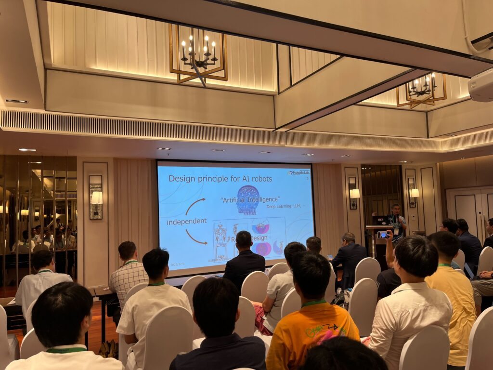

本研究室の学生が、CableCon2023 (Sixth International Conference on Cable-Driven Parallel Robots) に参加し、研究発表を行いました。

## 発表概要

今回の大会では、協調ロボティクス研究室から以下の研究発表を行いました：

### A Cable-Based Haptic Interface with a Reconfigurable Structure
- 発表者：Bastien Poitrimol、五十嵐 洋
- 発表日：2023年6月28日
- 再構成可能な構造を持つケーブルベースハプティックインターフェース

## 研究の意義

本研究では、ケーブル駆動システムの特徴である軽量性と高速性を活かしながら、再構成可能な構造により多様なハプティック体験を提供できるインターフェースを開発しました。従来のケーブル駆動ハプティックデバイスの限界を超える新しいアプローチとして注目されています。

## CableCon の特徴

CableConは、ケーブル駆動パラレルロボット（Cable-Driven Parallel Robots, CDPR）に特化した国際会議として、3年に一度開催される専門性の高い学術会議です。ケーブル駆動システムの理論、設計、制御、応用に関する最新の研究成果が発表される貴重な場です。

## 成果と今後の展望

ケーブル駆動技術の専門家が集まる国際会議での発表により、以下の成果を得ることができました：

- ケーブル駆動ハプティクスの新しい可能性の提示
- 国際的なケーブル駆動ロボティクス研究コミュニティとのネットワーク構築
- 今後の技術発展に向けた貴重なフィードバックの獲得

本研究で提案した再構成可能構造は、VR/ARアプリケーションや遠隔操作システムでの応用が期待されており、今後さらなる実用化に向けた研究を推進してまいります。