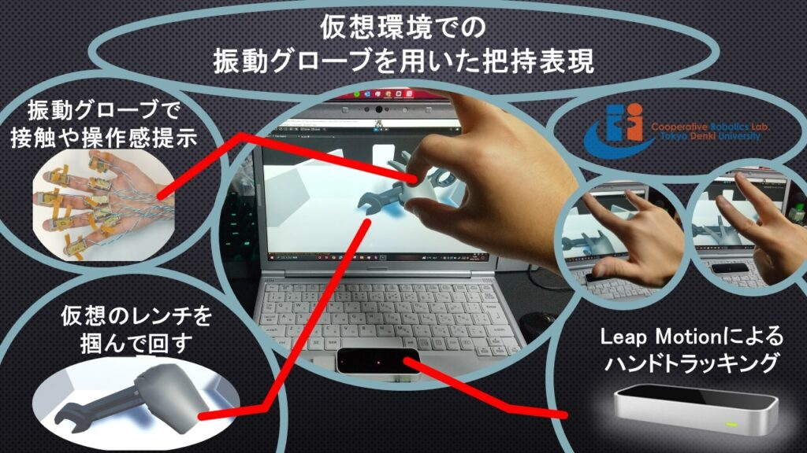
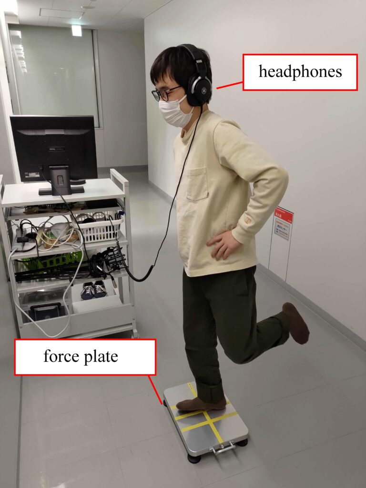
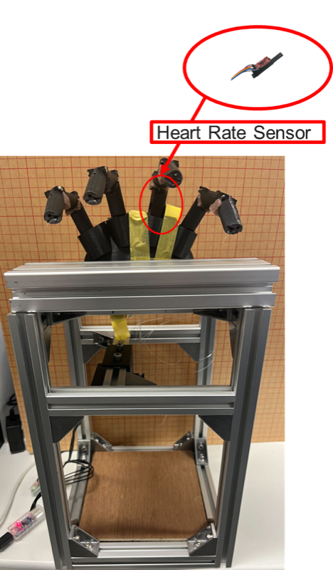
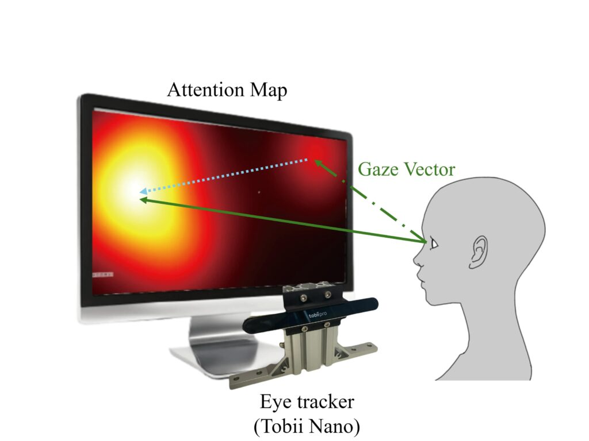
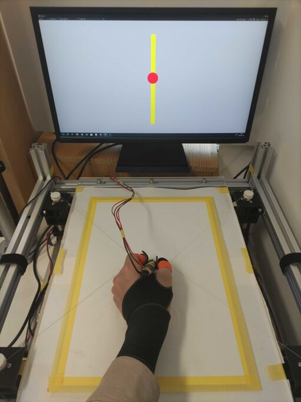

協調ロボティクス研究室では10月15日〔火〕～17日〔金〕、幕張メッセで開催されるCEATEC2024に出展いたしました。今回の展示会では「空気を読める賢さ」をテーマに、研究室の最新の研究成果やデモンストレーションを紹介しました。

## 展示内容

### 空気を読める賢さの実現

人と機械が共に働く未来を見据え、以下の技術デモンストレーションを実施しました：

### 1. チームワーク可視化システム
- リアルタイムでチーム内の「気づかい」や「信頼度」を定量化
- 生体信号センシングによる協調状態の見える化
- 来場者の皆様にも実際に体験していただきました

### 2. 触覚技能伝承システム
- 熟練者の技を触覚で学習できるハプティクスデバイス
- 視覚に頼らない新しい学習手法のデモ
- 製造業での技能継承への応用可能性を紹介

### 3. 協調ロボットプラットフォーム
- 人の意図を理解して適応するロボットシステム
- 動的な役割分担による効率的な協働作業
- Industry 4.0時代の新たな人機協調のあり方を提案

## デモンストレーションの様子

## 来場者との交流

4日間の会期中、多くの企業関係者、研究者、学生の皆様にお越しいただきました。特に以下のような反響をいただきました：

- 製造業各社から技能伝承システムへの高い関心
- ヘルスケア分野でのチームワーク分析技術への応用期待
- 教育機関からの共同研究に関するお問い合わせ

## 今後の展開

CEATEC2024での出展を通じて得られた貴重なフィードバックを基に、より実用的な技術開発を進めてまいります。また、展示会で生まれた新たなパートナーシップにより、産学連携による社会実装を加速させる予定です。

来年度も引き続き、人と機械が共生する未来社会の実現に向けた研究成果を広く発信してまいります。
