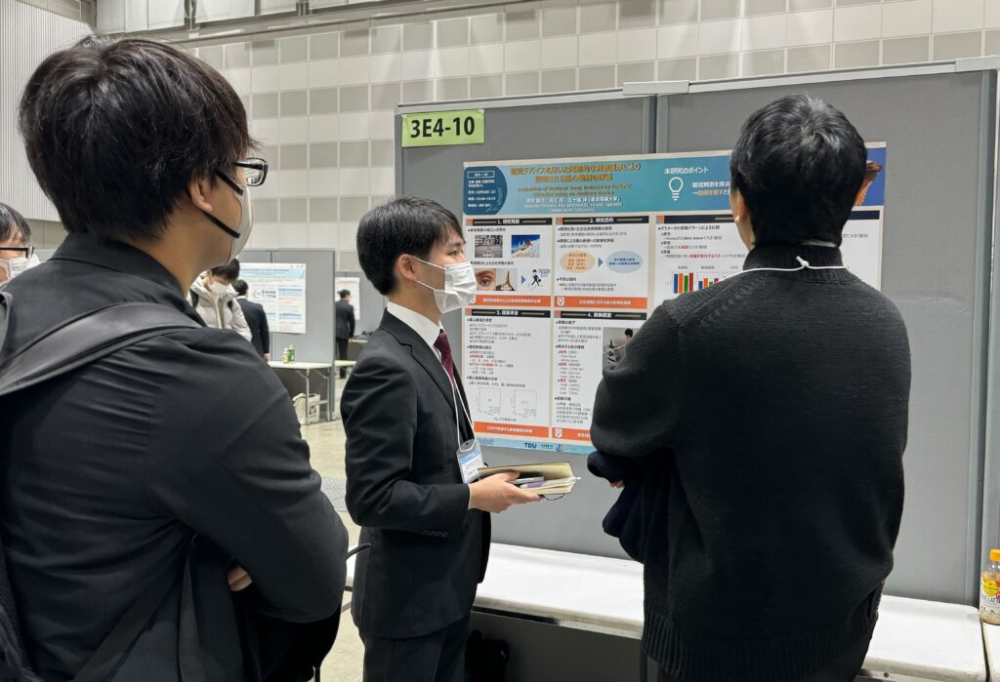

本研究室の学生らが、アメリカ・シカゴで開催されたIEEE IECON 2024 (50th Annual Conference of The IEEE Industrial Electronics Society) に参加し、2件の研究発表を行いました。

## 発表概要

今回の大会では、協調ロボティクス研究室から以下の2件の研究発表を行いました：

### 1. Modeling Human Learning Characteristics for Analyzing Human Teaching Methods
- 発表者：小林 航大、五十嵐 洋
- セッション：機械学習とヒューマン・ロボット・インタラクション
- ヒューマン・ロボット教示におけるヒューマンの学習特性をモデル化し、教示手法を解析する研究

### 2. Toward Realism of Haptic Texture: Environment-Adaptive Vibrotactile Transformation
- 発表者：戸塚 圭亮、五十嵐 洋
- セッション：ハプティクス技術とテクスチャ再現
- 環境適応型振動触覚変換による、よりリアルなハプティックテクスチャの実現に向けた研究

## 研究テーマの特徴

今回の発表では、以下の先端的な研究領域が展開されました：

- **機械学習ベース教示システム**: 人間の学習特性を機械学習でモデル化し、効果的な教示手法を解析
- **環境適応ハプティクス**: 環境に応じて振動触覚を変換し、よりリアルなテクスチャ体験を提供

## 成果と今後の展望

各発表において活発な質疑応答が行われ、特に産業応用における実用化に向けた期待の声を多数いただきました。IEEE Industrial Electronics Societyという産業エレクトロニクス分野の権威ある国際会議での発表により、研究の国際的な認知度向上と今後の共同研究の可能性を広げることができました。

今回得られた貴重なフィードバックを基に、実用化に向けた研究開発をさらに推進してまいります。