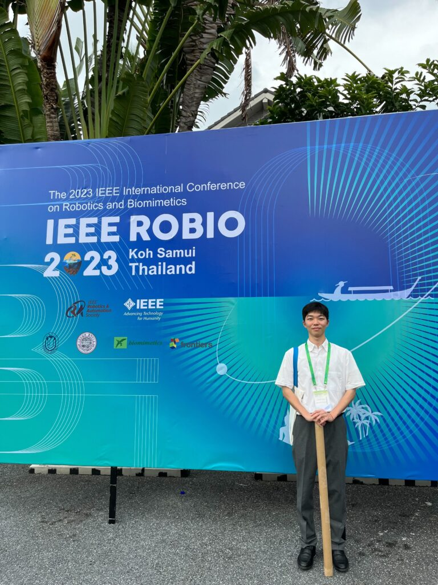

本研究室の学生が、タイのサムイ島で開催されたIEEE International Conference on Robotics and Biomimetics (ROBIO) 2023に参加し、研究発表を行いました。

## 発表概要

今回の大会では、協調ロボティクス研究室から以下の研究発表を行いました：

### Adaptive Guidance by Multi-Agent Systems Combining Personality Imitation and Independent Learning
- 発表者：小林 虎太郎、渡辺 亮、五十嵐 洋
- 発表日：2023年12月8日
- パーソナリティ模倣と独立学習を組み合わせたマルチエージェントシステムによる適応的誘導

## 研究の意義

本研究は、マルチエージェントシステムにおいて、個々のエージェントが他者のパーソナリティを模倣しながら独立学習を行うことで、より効果的な適応的誘導を実現するアプローチを提案しています。人間の社会的学習メカニズムをロボティクスに応用した革新的な研究です。

## IEEE ROBIO の特徴

IEEE ROBIOは、ロボティクスとバイオミメティクス（生体模倣技術）に特化したIEEE主催の国際会議です。生物の機能や構造からインスピレーションを得たロボティクス技術、知能システム、制御技術などの最新研究が発表される、アジア太平洋地域では最重要のロボティクス会議の一つです。

## 国際交流と成果

タイのリゾート地サムイ島という特別な環境での開催により、以下の成果を得ることができました：

- アジア太平洋地域を中心とした国際的な研究ネットワークの構築
- バイオミメティクスとマルチエージェント技術の融合に関する新たな知見の獲得
- 今後の国際共同研究の可能性の探索

## 今後の展望

本研究で提案したパーソナリティ模倣と独立学習を組み合わせた手法は、群集誘導、交通制御、災害時避難誘導などの実社会応用が期待されています。今回の国際会議での発表を通じて得られた知見をもとに、より実用的なマルチエージェントシステムの開発を推進してまいります。