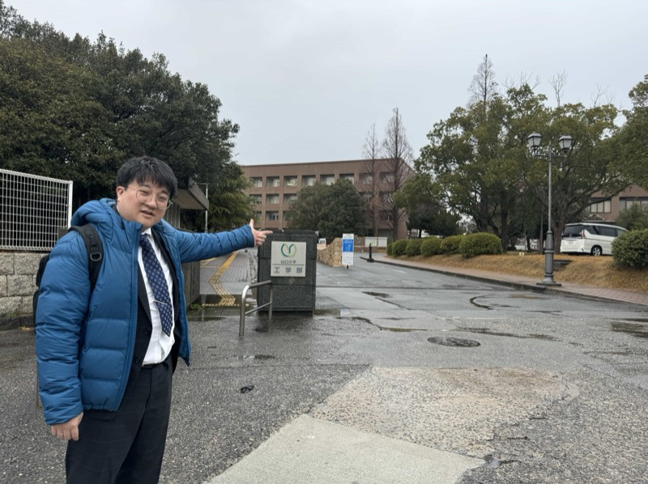
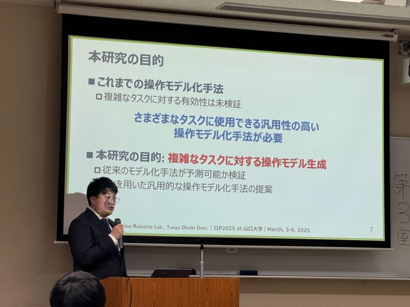
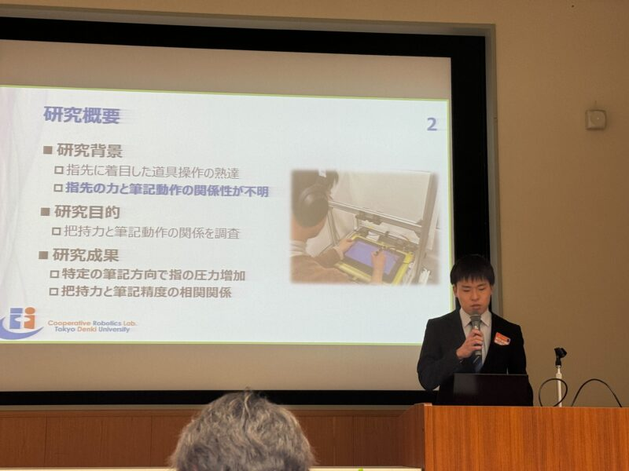

本研究室の学生らが、山口大学常盤キャンパスで行われた日本機械学会情報・知能・精密機器部門講演会（IIP2025）に参加し、4件の研究発表を行いました。

## 発表一覧

### 1. 仮想環境におけるマルチタスクでの認知アシスト
- 発表者：今村心哉、五十嵐 洋
- 発表番号：IIP-I1-6

### 2. 指先への力覚提示による筆記動作熟達に向けた把持力と筆運び、筆記姿勢の関係
- 発表者：梁瀬琉真、五十嵐 洋
- 発表番号：IIP-E7-4

### 3. 環境適応型振動提示の主観評価 ― ツール質量差が触覚体験に及ぼす影響
- 発表者：戸塚圭亮、五十嵐 洋
- 発表番号：IIP-E7-5

### 4. 複雑なタスクに対するヒトの操作のモデル化手法の提案
- 発表者：佐々木 元気、小林航大、五十嵐 洋
- 発表番号：IIP-F3-4

## 成果と今後の展望

各発表において活発な質疑応答が行われ、皆様から頂いたご意見や知見をもとに、今後の研究活動に活かしていきたい所存です。
