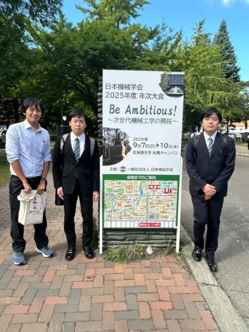
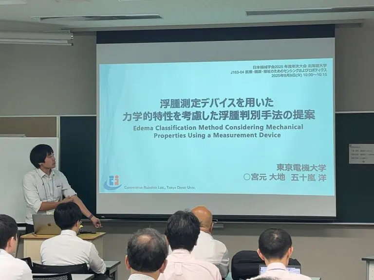
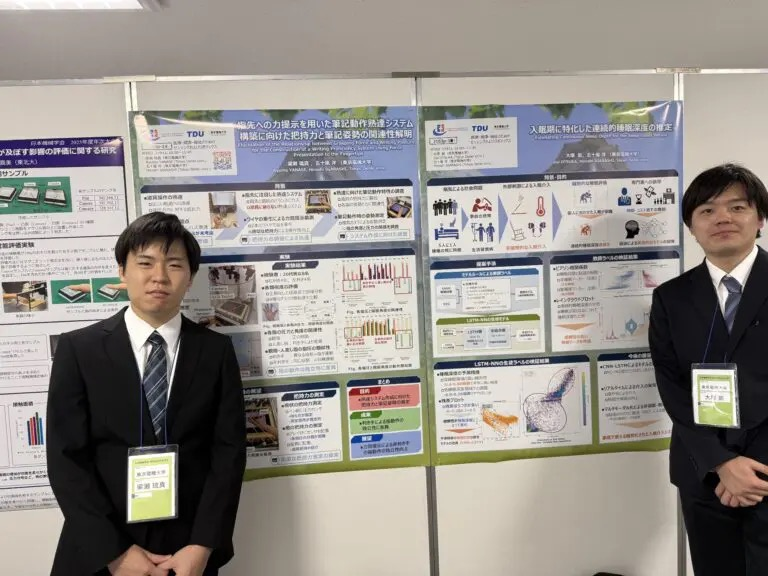
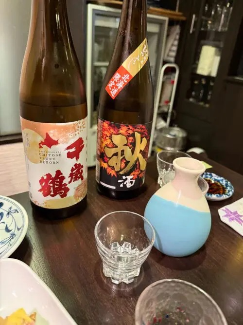

本研究室の学生らが、北海道大学で行われた日本機械学会 2025年度 年次大会（JSME）に参加し、3件の研究発表を行いました。

## 発表概要

今回の大会では、協調ロボティクス研究室から以下の3件の研究発表を行いました：

### 1. 浮腫測定デバイスを用いた力学的特性を考慮した浮腫判別手法の提案
- 発表者：博士3年 宮元 大地、五十嵐 洋
- 発表番号：J163-04（2025/09/09）
- 浮腫診断における新しいアプローチを提案

### 2. 指先への力提示を用いた筆記動作熟達システム構築に向けた把持力と筆記姿勢の関連性解明
- 発表者：修士2年 梁瀬 琉真、五十嵐 洋
- 発表番号：J163p-14（2025/09/08）
- 筆記技能向上のための力覚フィードバックシステムの研究

### 3. 入眠期に特化した連続的睡眠深度の推定
- 発表者：修士2年 大塚 凱、五十嵐 洋
- 発表番号：J163p-15（2025/09/08）
- 睡眠研究における新たな計測・解析手法の開発

## 会議の様子

## 成果と今後の展望

各発表において活発な質疑応答が行われ、特に産業界からの応用に関する期待の声を多数いただきました。今回得られた貴重なフィードバックを基に、実用化に向けた研究開発をさらに推進してまいります。

また、他研究機関との新たな共同研究の可能性についても議論を深めることができ、今後の研究ネットワーク拡大に向けた重要な機会となりました。
