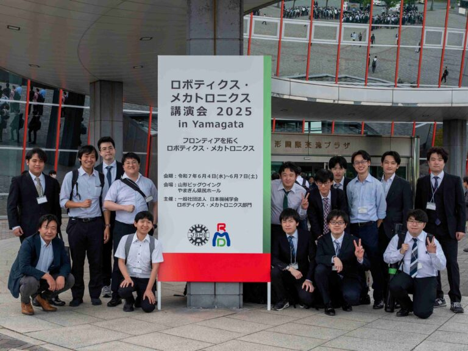
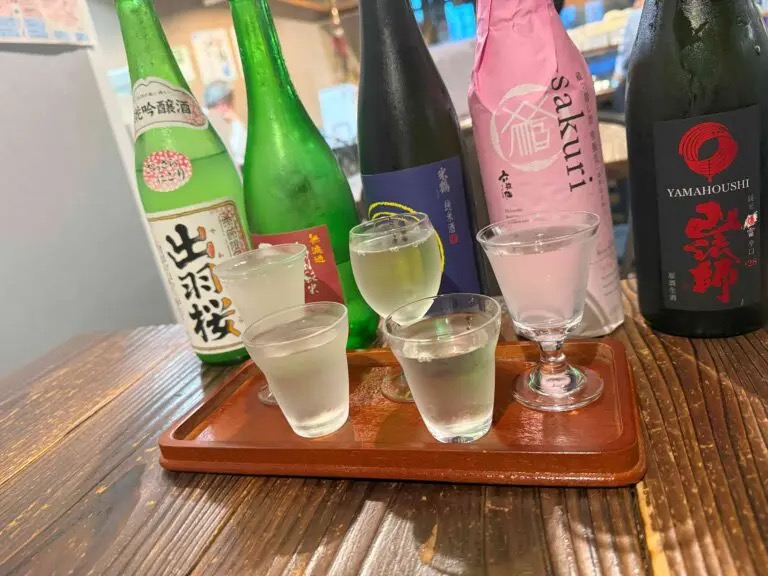

本研究室の学生らが、山形県で開催された日本機械学会ロボティクス・メカトロニクス講演会2025に参加し、14件の研究発表を行いました。

## 発表一覧

### 第1日目（2025年6月5日）

#### セッション1A1-T
1. 戸塚 圭亮、五十嵐 洋「プローブ先端形状と記録される触覚テクスチャ振動の関係」(1A1-T09)

#### セッション1A1-G
2. 宮元 大地、五十嵐 洋「多様な種別の判定に向けた浮腫測定デバイスの開発」(1A1-G07)

#### セッション1A1-K
3. 柏木 水輝、五十嵐 洋「エネルギー効率を考慮したマルチエージェントの誘導」(1A1-K01)

#### セッション1P1-F
4. 大塚 凱、五十嵐 洋「平衡感覚を刺激する振動の入眠促進効果の検討」(1P1-F02)

#### セッション1P1-P
5. 梁瀬 琉真、五十嵐 洋「指先への力覚提示による筆記動作熟達向けた把持力と筆記位置の関係」(1P1-P10)

### 第2日目（2025年6月6日）

#### セッション2A1-F
6. 田原 駿、五十嵐 洋「力覚提示による筋シナジー変化の調査」(2A1-F09)

#### セッション2A1-D
7. 北岩 隼人、五十嵐 洋「貝殻つなぎを用いた握り動作における握力の影響についての調査」(2A1-D11)

#### セッション2A1-Q
8. 中村 弘樹、五十嵐 洋「摩擦の違いによる器用さの熟達支援に向けた調査」(2A1-Q09)
9. 平塚 亮気、五十嵐 洋「可変ダイナミクスを導入した音程の視覚提示が歌唱音程制御に与える影響の調査」(2A1-Q10)

#### セッション2P1-L
10. 森下 陸、五十嵐 洋「プラセボ効果を活用した熟達支援システム」(2P1-L07)
11. 佐々木 元気、五十嵐 洋「pHHI：ヒト同士の物理的な協調作業における協調作業パフォーマンス推定手法の提案」(2P1-L12)

#### セッション2P1-M
12. 劉 樹鵬、五十嵐 洋「ストレスを考慮した周期的な協働作業におけるアシストの提案」(2P1-M05)
13. 小林 航大、五十嵐 洋「学習者再現のためのモデル作成における学習率調整手法」(2P1-M06)

#### セッション2P2-I
14. 加藤 陸生、五十嵐 洋「マルチエージェントシステムにおける探索精度分布を活用した協調探索」(2P2-I05)

## 研究テーマの多様性

今回の発表では、協調ロボティクス研究室の幅広い研究領域が展開されました：

- **触覚・ハプティクス技術**: 戸塚、梁瀬、田原の研究
- **生体信号・睡眠研究**: 大塚の入眠促進研究
- **マルチエージェントシステム**: 柏木、加藤の協調探索研究
- **ヒューマンセンシング**: 佐々木、劉、北岩の協調・ストレス解析
- **熟達支援システム**: 中村、平塚、森下の技能学習支援
- **医用工学**: 宮元の浮腫測定技術

## 会議の様子

## 成果と今後の展望

各発表において活発な質疑応答が行われ、特に産業応用や実用化に向けた期待の声を多数いただきました。また、他大学・企業の研究者との新たな連携の可能性についても議論を深めることができました。

今回得られた貴重なフィードバックを基に、研究の実用化と社会実装に向けたさらなる発展を目指してまいります。