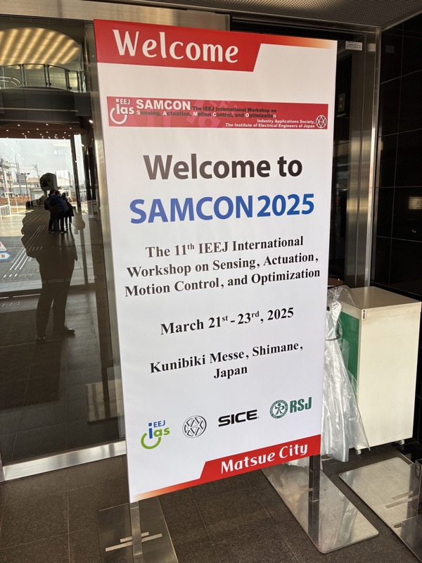
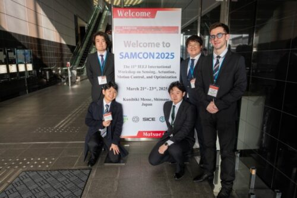

うちの研究室の学生たちが、先日島根県で開催された「SAMCON2025」に参加して、合計5件の研究発表を行いました！

## 発表一覧

### 1. バーチャルリアリティ環境における力覚提示を用いた多様性を重視した筆記動作熟達支援の実用化検討
- 発表者：梁瀬琉真、五十嵐 洋

### 2. 協調作業におけるテンション制御に基づく協調支援システム
- 発表者：北岩雼人、五十嵐 洋

### 3. 周期的な協働作業における人の変動に対するロボットの適応
- 発表者：劉 樹鵬、五十嵐 洋

### 4. マルチロボットシステムにおける個体間の能力の違いを考慮した協調手法の提案
- 発表者：加藤陸生、五十嵐 洋

### 5. 力覚提示による筋シナジー変化と熟達の関係についての調査
- 発表者：田原 駿、五十嵐 洋

## 成果と今後の展望

それぞれが日頃取り組んでいるテーマについて、自分の言葉でしっかりと発表し、多くの方々から貴重なコメントやフィードバックをいただくことができました。
