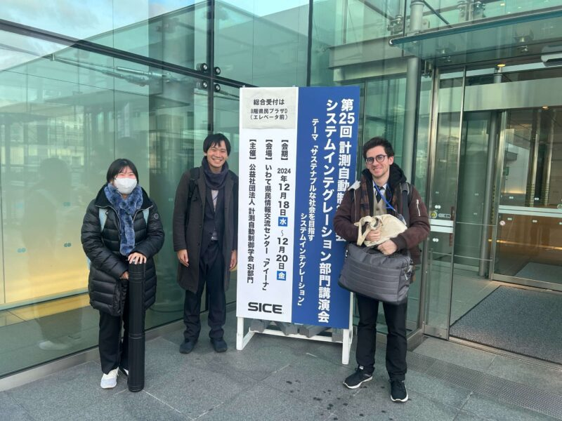

本研究室の学生らが、アイーナ いわて県民情報交流センターで行われた第25回計測自動制御学会システムインテグレーション部門講演会（SI2024）に参加し、3件の研究発表を行いました。

## 発表一覧

### 1. 拡張現実を用いた透過的な可視化による機械の動作理解促進手法の基礎検討
- 発表者：大江翔太、五十嵐 洋
- 発表番号：2E3-04

### 2. 筆記動作の熟達支援に向けた力覚フィードバックの研究～筆圧と筆記線との関係
- 発表者：梁瀬琉真、五十嵐 洋
- 発表番号：3C2-04

### 3. 寝返り支援における要支援者の腰部圧迫軽減を目的としたマットレス型支援システムの開発
- 発表者：今村 心哉、五十嵐 洋
- 発表番号：3C2-10

## 成果と今後の展望

各発表において活発な質疑応答が行われ、皆様から頂いたご意見や知見をもとに、今後の研究活動に活かしていきたい所存です。
