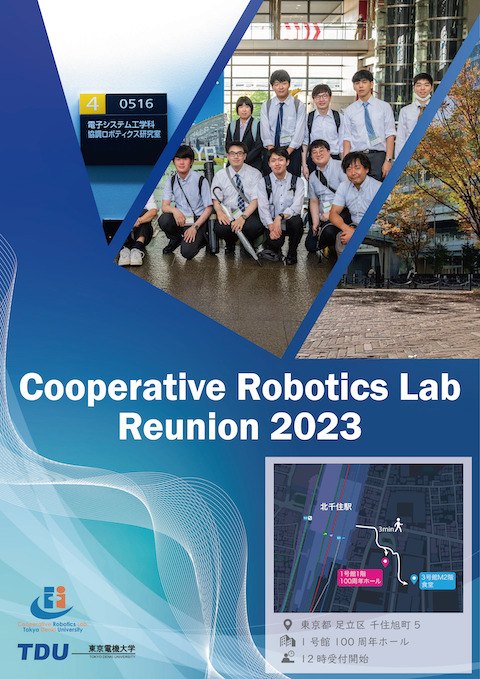

本研究室の学生らが、オランダのデルフト工科大学で開催されたIEEE World Haptics 2023 Conferenceに参加し、2件の研究発表を行いました。

## 発表概要

今回の大会では、協調ロボティクス研究室から以下の2件の研究発表を行いました：

### 1. A User Study of a Cable Haptic Interface with a Reconfigurable Structure
- 発表者：Bastien Jacques Étienne Poitrimol、五十嵐 洋
- セッション：TP.C3.4
- 発表日：2023年7月13日
- 再構成可能な構造を持つケーブル型ハプティックインターフェースのユーザー評価

### 2. Effects on Perception when Removing One Frequency Component from Two Harmonic Vibrations
- 発表者：戸塚 圭亮、五十嵐 洋
- セッション：TP.C3.5
- 発表日：2023年7月12日
- 2つの調和振動から1つの周波数成分を除去した時の知覚への影響

## 研究テーマの特徴

今回の発表では、以下の先端的なハプティクス技術が展開されました：

- **ケーブル駆動ハプティクス**: 再構成可能な構造によるワークスペース拡大と操作性向上
- **振動触覚の知覚メカニズム**: 周波数成分の相互作用による触覚知覚の解明

## 国際交流と成果

World Haptics Conferenceは、触覚技術分野における世界最高峰の国際会議です。IEEE主催のこの会議では、世界各国から集まった触覚技術研究者との活発な議論を通じて、以下の成果を得ることができました：

- 国際的な研究ネットワークの構築
- 最新のハプティクス技術動向の把握
- 今後の共同研究の可能性の探索

## 今後の展望

国際会議での発表を通じて得られた知見をもとに、ケーブル駆動ハプティクスシステムのさらなる発展と、振動触覚技術の実用化に向けた研究を推進してまいります。特に、ヨーロッパの研究機関との連携による国際共同研究の可能性についても積極的に検討してまいります。