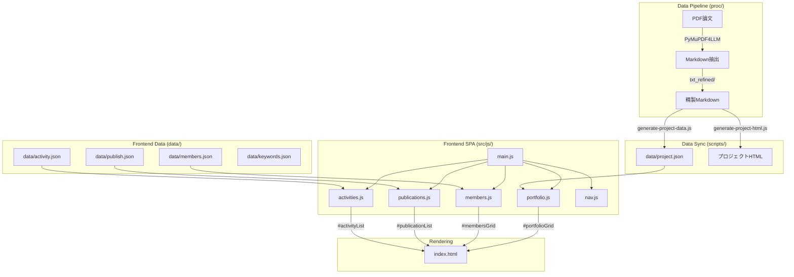

# Architecture Overview

## システム全体図

## データフロー

1. **Upstream**: PDF論文 → PyMuPDF4LLMでMarkdown抽出 → `proc/txt_refined/` に保存
2. **Sync**: `scripts/generate-project-data.js` が精製Markdownを読み込み → `data/project.json` を生成
3. **Frontend**: 各JSモジュールが対応JSONをfetch → DOMに描画
4. **Build**: `npm run build` 時に `prebuild` フックで `generate:all` が自動実行

## フィルタリングパターン

全セクション共通のフィルタリング設計:

- **Tag filter buttons**: `data-tag` / `data-*-category` 属性
- **Search input**: `#projectSearch`, `#memberSearch`, `#publicationSearch`
- **Active state**: `aria-pressed="true"`
- **Expand/Collapse**: "残りを表示" ボタン + `data-*-toggle`

## 技術スタック

| レイヤー | 技術 |
|---------|------|
| ビルド | Vite 7.x |
| フロントエンド | Vanilla JavaScript (ES6 modules) |
| Markdown処理 | marked 17.x |
| スタイル | CSS (SCSS → CSS) |
| データ処理 | Python (PyMuPDF4LLM), Node.js |
| アクセシビリティ | WCAG AA, UDC準拠 |

## デザインシステム

- **UDC (Universal Design Color)** 準拠
- レスポンシブ: Mobile (<768px) / Tablet (768-1024px) / Desktop (>1024px)
- CSS Grid + Flexbox（`.grid--columns-3` で3カラム）
- コンポーネント: `.card`, `.filter-chip`, `.btn-primary`, `.section`
