# 2025年9月18日 研究概要一覧

## 田中 佑樹 (21EH050)
- 研究テーマ: 条件付け学習を用いた視覚による触覚フィードバック強化
- 参考画像: 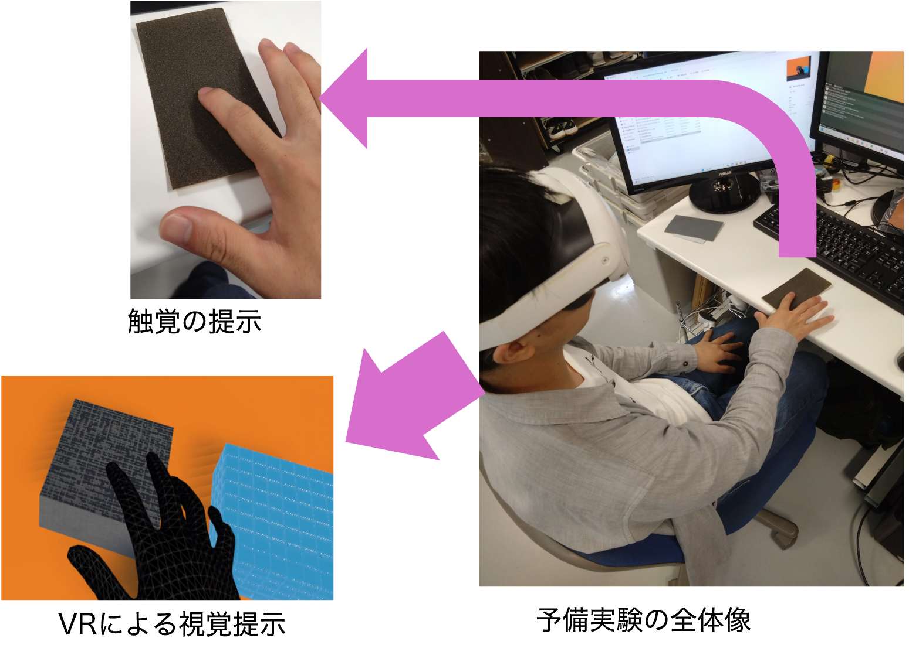
- 概要:
  - 現在,VRにおける触覚,力覚情報の欠如が繊細な操作や訓練の難化を招いている。また,既存の触覚提示機器を用いた場合,特定の状況,用途に特化している場合が多い。そのため複合的な触覚,力覚,個人の感覚差に対応できず汎用性に欠けるという課題がある。本研究では,実践で機器に依存しない,個人の感覚差にも適応可能な触覚認知の強化手法を確立することを目的とする。提案手法として,古典的条件付け学習を応用し,視覚刺激と実際の触覚刺激を結びつける訓練を行う。これにより,視覚のみから触覚を想起させることを目指し,提案手法の優位性の検証を行っている。現状の結果,触覚の学習に対し,能動的な被験者は触覚オブジェクトをなぞるタスクで触覚を確認する様子想起が得意,受動的な被験者は不得意な可能性がある。

## 三山 誓也 (21EH097)
- 研究テーマ: 運転者の情動へのリアルタイム介入がもたらす操作主体感向上のサブリミナルアシスト
- 参考画像: 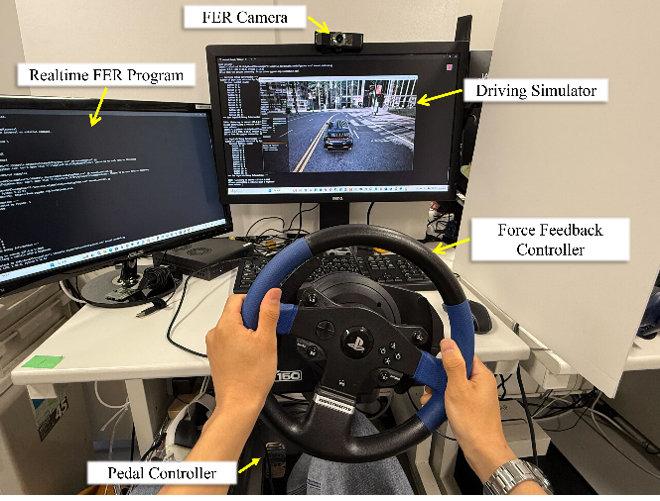
- 概要:
  - 運転支援技術の台頭は事故リスクを回避する一方、人間の介入機会を減らし、操作による根源的な主体感の喪失を招く課題がある。人間が機械を思い通りに操作する感覚である操作主体感は、特に運転が苦手な非熟練者にとっては得ることが困難である。本研究では、操作成功時に生まれる達成感や楽しさに着目し、この状態に介入する新たな熟達支援を提案する。NN(ニューラルネットワーク)によるリアルタイム表情認識によって感情を検出し、その体験を強化するサブリミナルキャリブレーションを実施。この介入が操作主体感を高め、楽しさを通じて効率的な熟達を促す正のサイクルを構築し、持続的な学習意欲の創出につなげることを目指す。実験系の構成

## 渡辺 佑樹 (21EH105)
- 研究テーマ: リズムの予測可能性を操作した非言語コミュニケーション手法
- 参考画像: 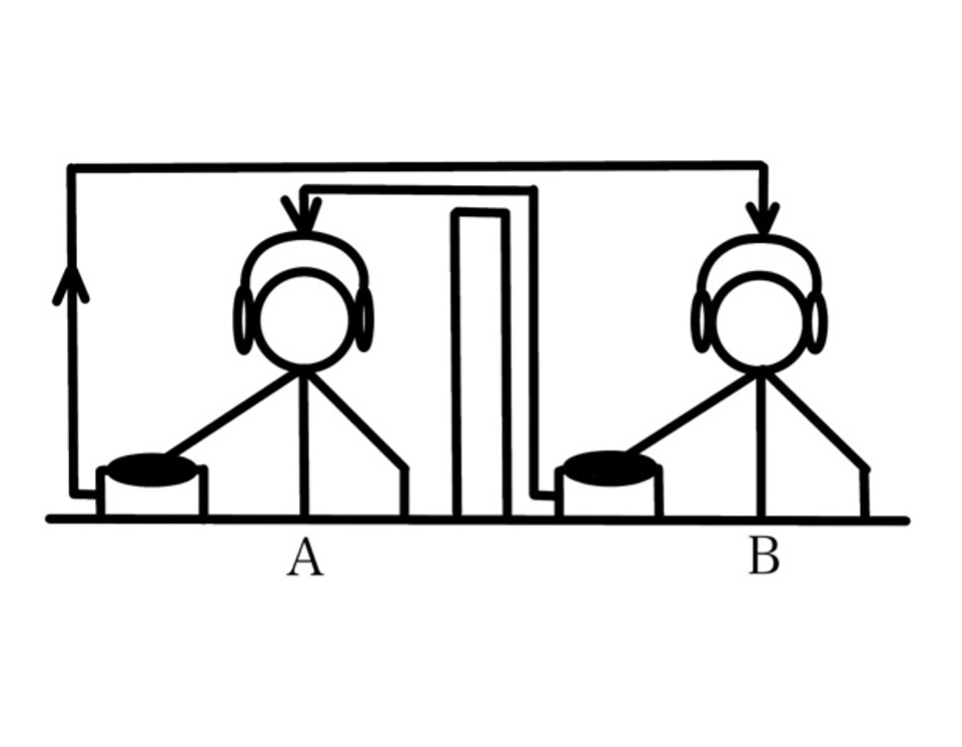
- 概要:
  - 言語に依存しない協調行動として、非言語コミュニケーションが存在する。先行研究ではリズム課題を通じた協調の検討が行われてきたが、多くは単純な構造のリズム課題や、楽器演奏のような専門技術を要する課題にとどまり、実際の協調作業に近い状況でリズム共有を捉える枠組みは十分に整っていない。本研究は、協調性・同期性・効率性・柔軟性を包括的に評価することを目的とし、餅つき動作を模した「交互打ち＋同時打ち」課題を設計した。二者が交互に拍を刻み、最後に同時に押す構造により同期性を評価する実験系を構築した。今後は、理想テンポ（BPM120）からのズレを効率性として測定し、外乱や変化への適応を柔軟性の指標とする実験の様子拡張を目指す。

## 伊藤 亮太 (22EH017)
- 研究テーマ: 音と振動の同期ずれが臨場感に及ぼす影響の比較
- 参考画像: 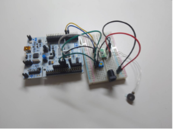
- 概要:
  - オンラインライブの課題点として、その場にいる感覚（臨場感）の不足が問題となっている。近年では音と同期した振動提示による臨場感向上が進められている。しかし、その際の課題点として、音と振動のタイミングがずれることで引きおこされる違和感や没入低下があげられている。既存研究は印象評価が中心で、音と振動の非同期が臨場感に及ぼす機序について十分に説明されていない。本研究では、音に対する振動の同期ずれの方向（音先行/振動先行）とずれの大きさが臨場感に与える影響を精査する。遅延の方向と大きさを操作して臨場感尺度と呼ばれる客観指標により評価を取得する。得られた閾値や非対称性を基に触覚提示タイミングの設計指針を提示し、同期ずれによる臨場感の影響を比較することを目的とする。

## 大西 葵稀 (22EH023)
- 研究テーマ: マルチホップ通信を活用した局所適応型マルチエージェント情報伝達の効率化
- 参考画像: 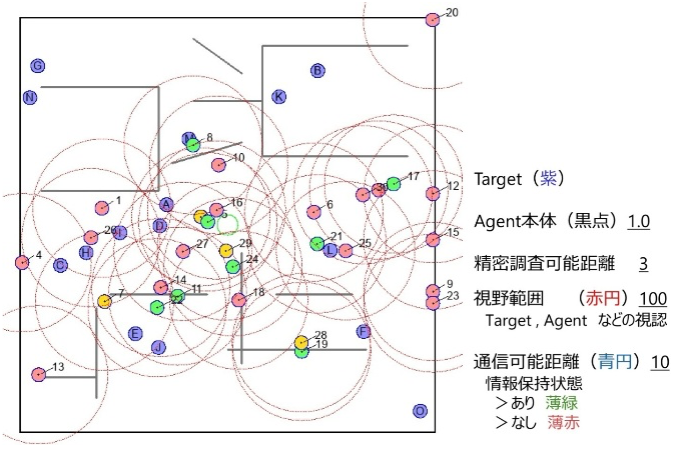
- 概要:
  - 災害現場や工場のように通信や視界が途切れる環境では，ロボットが観測した内容を報告することは困難である．そのため，情報を中継するための協調行動が不可欠となる．本研究では，周囲の環境を分析し，「現在の行動」が「将来どのように役立つか」を推論することで，自律的に行動を選択可能な手法を提案する．これにより，ロボットは探索や中継といった役割を担う動作をその場で判断し，協調行動が自然に生じることが期待できる．現時点では，設計者が直接ルールを与えた基準モデルの評価をしており，今後はこのモデルを基準として，設計シミュレーション環境中である推論モデルの性能を検証していく予定である．

## 河内 健志 (22EH034)
- 研究テーマ: マルチエージェントシステムによる大規模災害への対応
- 参考画像: 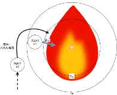
- 概要:
  - 災害は，発生時期や規模の想定の難しさから，対応に必要な人員を常に十分に用意することは困難である．また，特に火災などの場合，高温や有毒ガスなどの影響から，被災地に突入する人員が死傷するリスクも高い．本研究では，複数のロボットを用いたマルチエージェントシステムによる災害対応について，特に大規模火災の消火について着目し，検証を行う．単純なロボット群の相互作用により，想定規模に合わせたエージェント数の拡張や，被災地内でのエージェントの損傷に対応できる柔軟性を持ったシステムを作ることで，少人数で安全かつ効率的な災害対応の実現を目指す．
  - エージェント群による消火行動のイメージ

## 進藤 滉平 (22EH059)
- 研究テーマ: 視覚による錯覚を用いた握り込み調整
- 参考画像: 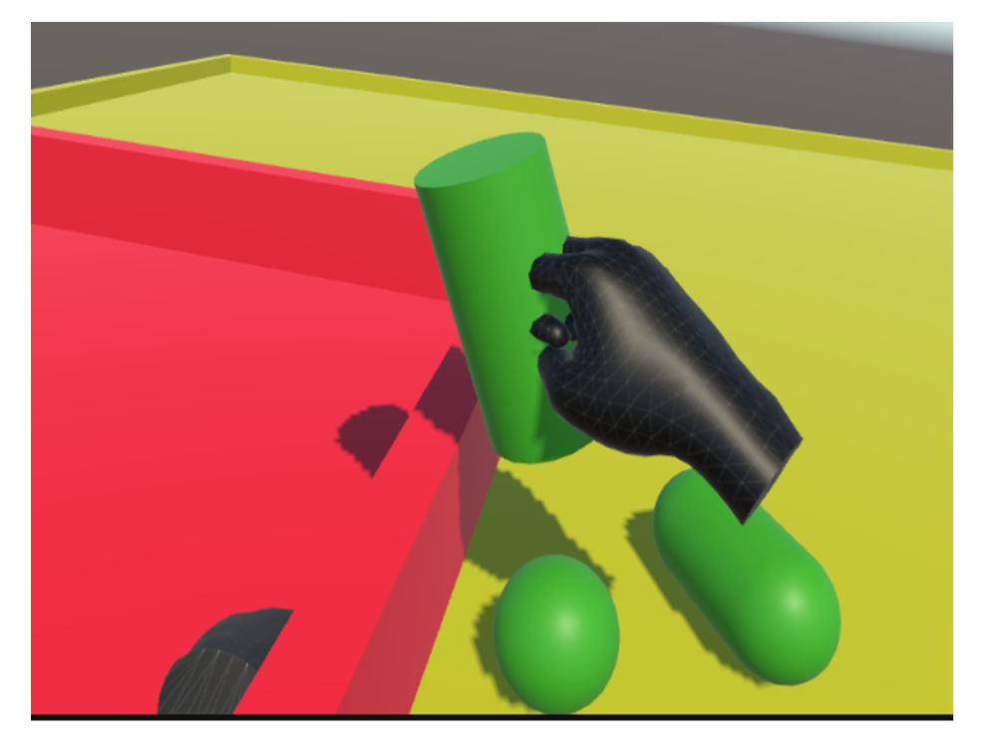
- 概要:
  - 現在VRはエンターテインメント分野だけでなく，職業訓練にも使用されている．そこではVRの視覚情報で錯覚を起こし，作業訓練時に大切な握り込みを調整させることが重要となっている．先行研究によると，手が冷えると無意識的に握り込みが強くなる．また見ている色によって感じる温度が変化する(色温度効果)．そこで本研究では，握り込みを強くさせたい時に手の色を寒色系の色へ，逆に弱くさせたい時には暖色系の色へ変化させ握り込みの調整を行う．これを評価するために，仮想空間上で物を運ぶタスクを実施する．このときの握り込みを指の曲がり具合，またはコントローラーを握る力から取得する．このタスクを錯覚ありとなしで行い，提案手法の有効性を確かめる．

## 行木 想 (22EH079)
- 研究テーマ: 振動刺激を用いた直観的なグルーヴ感共有システムの開発
- 参考画像: 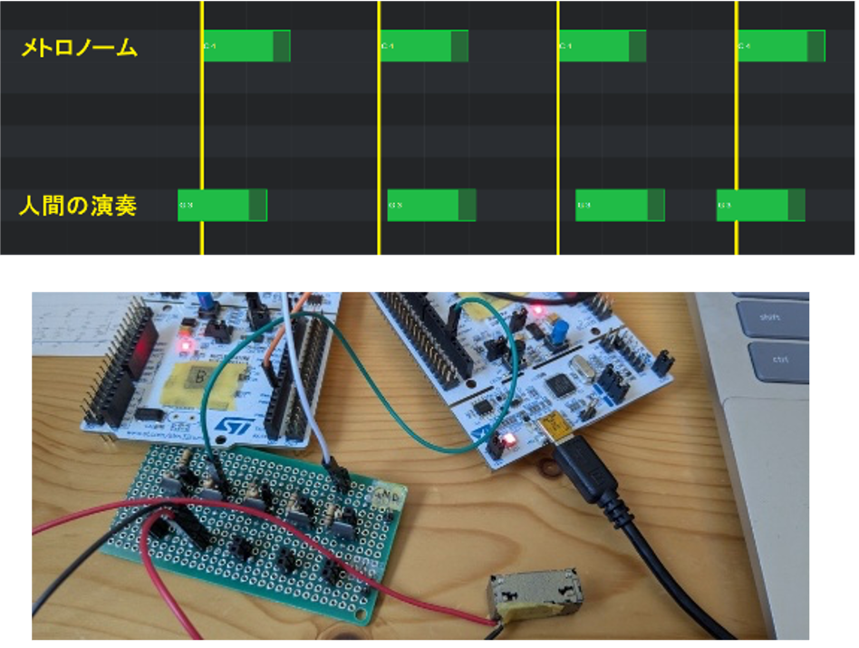
- 概要:
  - 音楽における「ノリ」を表す指標として「グルーヴ感」という概念が存在する. バンドやオーケストラなど, 複数人で協力して楽器を演奏する場面では, メンバー間でグルーヴ感を共有することで, 一体感のある演奏が可能となる. 現在, グルーヴ感を共有するシステムでは, 主に聴覚へのアプローチが用いられている. しかし, この手法は直観的でなく, 個人のリズム感に依存するなどの問題点がある. 本研究では, 従来の聴覚や視覚に加え, 振動による触覚刺激を用いてリズムを伝達することで, より直観的にグルーヴ感の共有を行うことが可能なシステムの開発を目指している. 現在,「人間特有のゆらぎを含んだリズム」を振動として提示する手法について実験している段階である. 上：ゆらぎを含んだリズム 下：実験システム

## 野澤 侑司 (22EH080)
- 研究テーマ: 視覚探索における光度変化による被誘導型アシストの効果検証
- 参考画像: 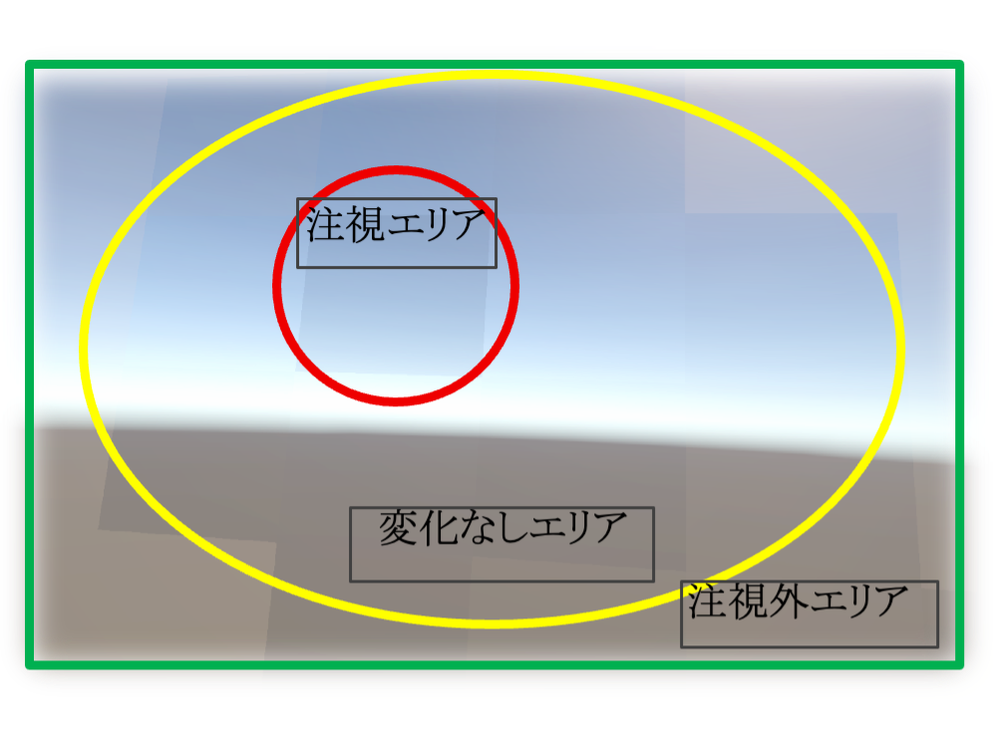
- 概要:
  - 近年VRやAR技術などの発展により、多様な分野での活用が期待されている。しかし、情報量の増加は見落としを引き起こす可能性がある。これを防ぐために視線誘導に関する研究が進められており、探索の正答率や反応時間の改善が報告されている。一方で、アシスト自体に視線が囚われてしまうという課題がある。そこで本研究では、ユーザの主体的な注意を促す「被誘導型のアシスト」を検証する。人は明るい領域に視線を向けやすく、また顕著性が抑えられると注視時間が短くなるという特性を利用し、微細な光度変化によって視線誘導を行うアシストを提案する。提案するアシスト

## 長谷川 智之 (22EH084)
- 研究テーマ: フィードフォワードによる早期熟達のための追加四肢のFB法
- 参考画像: 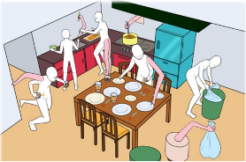
- 概要:
  - 近年，身体拡張の技術が発展してきており，第3の腕のような追加四肢による効率化が図られている．操作には主に3つの手法があり，最も効率が上がると予想される非身体拘束型には熟達に要する時間が長いことが問題とされている．予測モデルの早期獲得による，予測と結果の誤差を減らすことが熟達に効果的だと考えられる．本研究ではVR環境を用いた非身体拘束型での操作時の予測モデル早期獲得につながるFB方法を提案する．この研究では早期モデル獲得で有効と考えられるFB手法が正しいのかを検証する．想定される将来図

## 原田 遥輝 (22EH088)
- 研究テーマ: 視線情報を用いた身体性予測モデルの生成
- 参考画像: 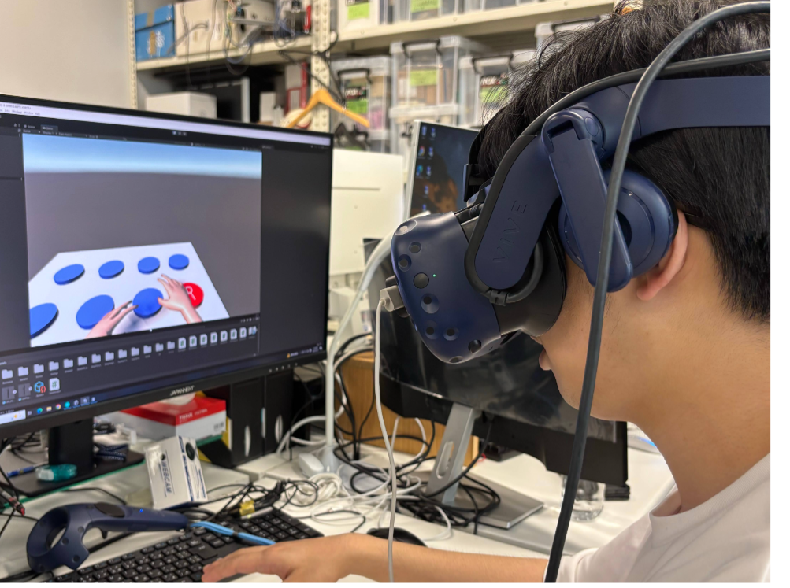
- 概要:
  - 仮想環境（VR）は職業訓練やリハビリ等で活用が進められている. その効果は利用者が仮想身体を自己のものと認識する「身体性」に影響される. 訓練効果の向上には脳波等の客観的評価が重要であるが, 利用者の負担に課題がある. そこで手軽な視線による身体性評価が注目されている. 先行研究で, 仮想身体への違和感が強いほど体に注目が高まるといった報告がされているが,その関係性の程度には言及されていない. そこで本研究では, 仮想ハンドの写実性や運動遅延を用いて身体性を意図的に変化させる実験を実行する. その際の視線データから身体性の度合いを予測し, モデル化することを目的とする. 図 仮想環境タスクの様子

## カ ムナ (25KMH04)
- 研究テーマ: ストレスモニタリングに基づく振動・音響介入の学習パフォーマンスへの影響
- 参考画像: 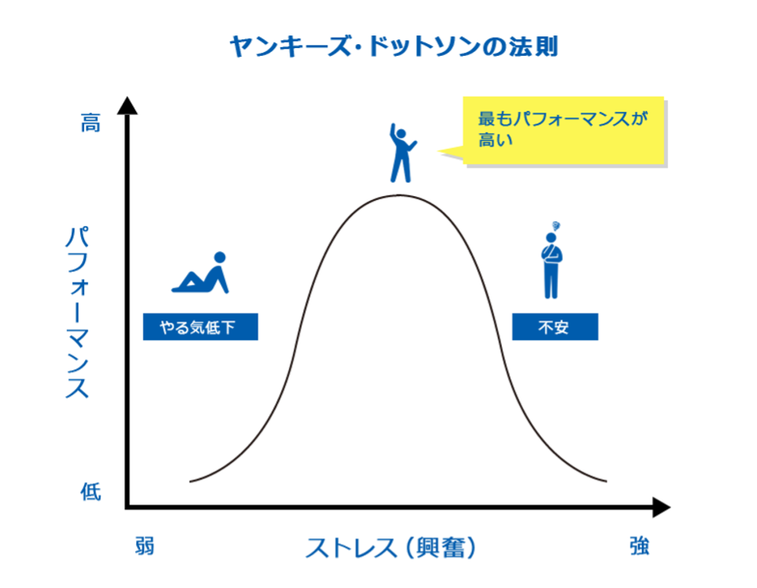
- 概要:
  - 従来のストレス管理手法は、個人の生理状態や時間的変動を十分に考慮しないため、注意力や学習効率の向上に限界があった。本研究はこの課題に対し、心拍変動（HRV）に基づくリアルタイムストレスモニタリングと、振動・音響刺激を用いた適応的介入システムを提案する。これまでに、関連研究の調査を終え、予備実験のための計測デバイス（BITalino等）を整備。HRVの計測・解析プロトコルの確立と予備的なデータ収集を実施した。現在は、収集したHRVデータに基づくストレス状態の分類アルゴリズムの構築と、40Hzの音響・振動刺激が覚醒度に与える影響の検証を進めている。今後は、介入効果の詳細な評価とパラメータ最適化を行い、教育現場などへの応用を目指す。ストレスレベルと学習パフォーマンスの関係および介入の概念図

## 柏木 水輝 (25KMH05)
- 研究テーマ: 個性模倣による省エネルギーなシープドッグシステム
- 参考画像: 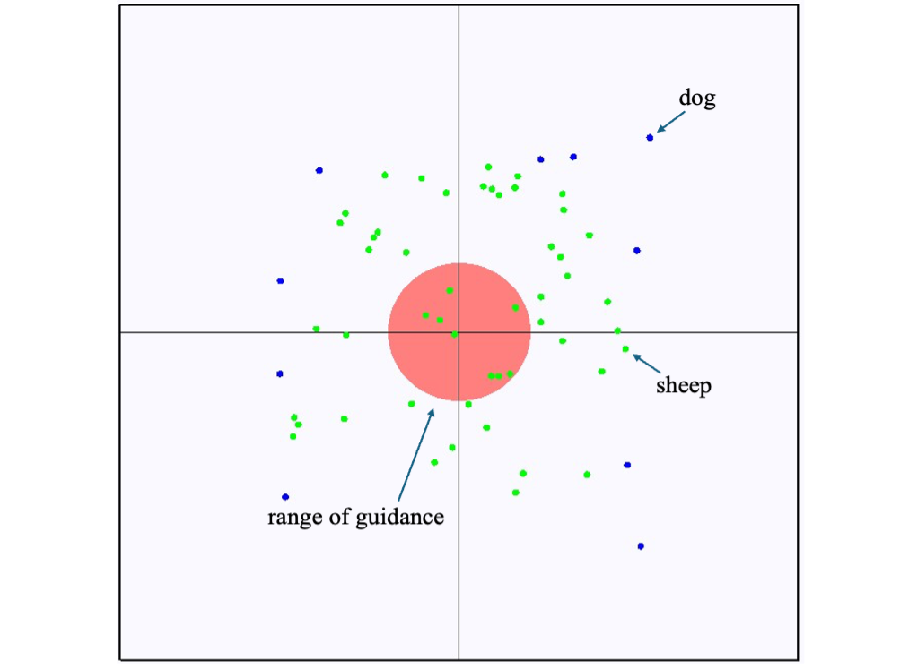
- 概要:
  - 多数のエージェント群を少数で誘導するシープドッグシステムは、ロボットによる目標物の誘導、回収や森林火災の燃焼防止などへの応用が期待されている。しかし既存研究ではエネルギーを考慮しおらず、長期運用を想定した実用化は困難である。そこで本研究は、エージェントが相互の個性を模倣する適応的な手法によって、省エネルギーかつ高い誘導性能を両立するシステムの設計を目的とする。結果として模倣することで誘導パフォーマンスの向上が見られ、エネルギーを評価に加えることでより省エネルギーな動作が可能だと分かった。
  - シミュレーションの実行例

## 加藤 陸生 (25KMH07)
- 研究テーマ: 複雑環境下における高カバレッジ分散探索の実現
- 参考画像: 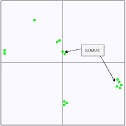
- 概要:
  - 未知環境における自律探索では、地形の差異や動的障害物により従来手法は性能が劣化する課題がある。特に従来は静的障害物を前提とした最適化が多く、環境変化への対応が十分でない。本研究では、複数のロボットが分散して協調的に行動する群ロボットシステムを用いて、どのような環境下においても一定以上の探索性能を保証できる汎用的な手法の確立を目指す。具体的には、傾斜・障害物・複雑な地形など様々な条件下でアルゴリズムの頑健性を評価し、新規環境においても高いカバレッジを維持できるかを検証する。特に、未知かつ動的な障害物の存在下での適応性を重視し、シミュレーションによる実験を通じて有用性を示すことを目的とする。シミュレーションの実行画面

## コ ゲツメイ (25KMH09)
- 研究テーマ: VR 環境で触覚グローブに基づく粘着感のシミュレーション
- 参考画像: 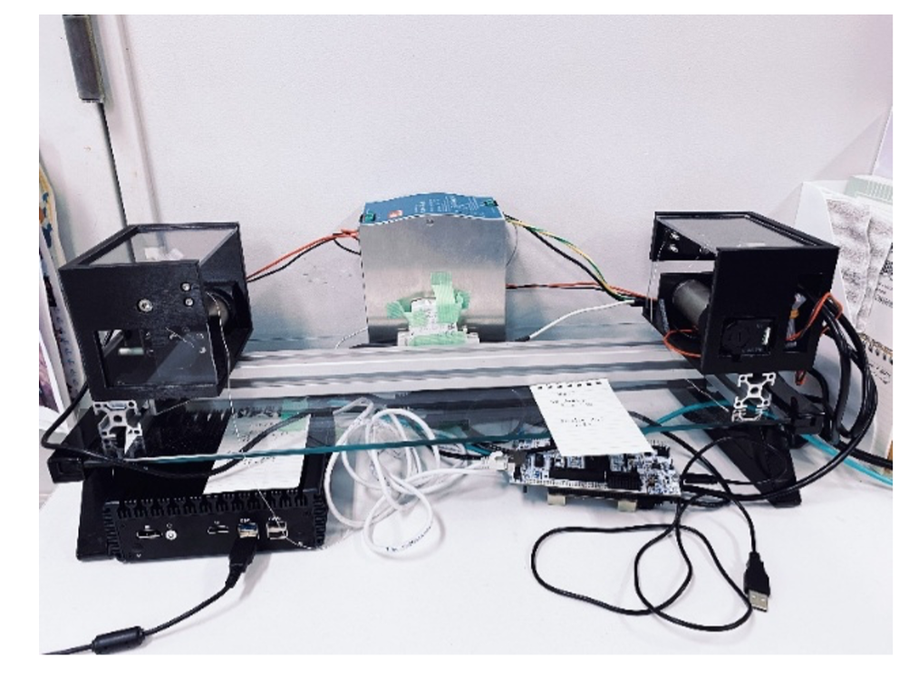
- 概要:
  - 触覚グローブはVR環境で広く利用されているが、粘着感の再現はほとんど研究されていない。粘着感は触覚の重要な要素であり、その再現はVR体験の没入感向上や医学教育における触診訓練シミュレータの質向上にもつながる。本研究では、ワイヤーによる力覚フィードバックで指の動きを制御し、物体が指腹から離れる際の感覚を再現するグローブを提案し、視覚誘導を併用することでよりリアルな提示を目指す。こうした背景のもと、関連研究の調査を完了し、ハードウェアおよびソフトウェアを含む初期的な実験システムを構築した。通信の安定動作やエンコーダによる位置取得を確認するとともに、ワイヤーを張力状態に保ちながら指先に一定の力を加えるPD制御を実装し、基本的な力覚提示が可能であることを示した。現在の研究段階におけるハードウェア構築

## 田原 駿 (25KMH15)
- 研究テーマ: 個人最適な熟達支援のための VAE を用いた運動スキル・スタイル分離モデル
- 参考画像: 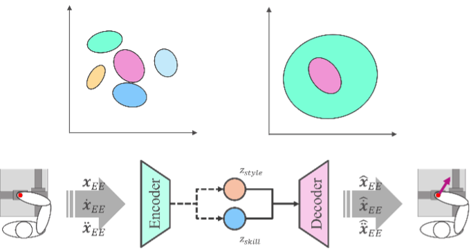
- 概要:
  - 画一的な運動指導は，学習者一人ひとりの身体的・認知的特性を無視するため，必ずしも効率的な熟達を促さないという課題を持つ．本研究は，この課題に対し，運動の生成モデルによる個人最適化された熟達支援を提案する．本手法では，変分オートエンコーダ（VAE）を基盤とするモデルを用い，運動軌道データから動作の普遍的な動作要素である「スキル」と，個人に固有の「スタイル（癖）」を潜在空間上で分離して学習する．これにより，学習者個人のスタイルを維持しつつ，その熟達度をわずかに上回る「最適なお手本」を動的に生成し，効率的なスキル獲得を支援することを目指す．図 スキル・スタイル分離 VAE

## 中村 弘樹 (25KMH19)
- 研究テーマ: 器用さの熟達支援に向けた摩擦条件の調査
- 参考画像: 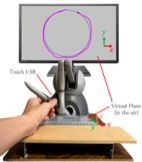
- 概要:
  - 手先の不器用さは，自身の手先を意思通りに動作させることが困難である状態を指し，自尊感情の低下に影響を及ぼしたり学習の妨げになることが明らかになっている．本研究では、この課題に対して摩擦力調整による筆記精度の熟達支援を提案する。運筆コントロールには、固有受容性感覚，視覚の感覚フィードバックが重要であるという報告がある。特に固有受容性感覚が運筆をコントロールする役割を果たしていると言われている。そこで本研究では、固有受容性感覚として筆記時の摩擦に注目した。文字の線や部分に応じて筆記時の摩擦を動的に変化させ、筆記精度の熟達を促す手法の確立を目指す。図 実験の様子

## 平塚 亮気 (25KMH21)
- 研究テーマ: 学習者自身の声質に変換した範唱見本による歌唱学習効果の調査
- 参考画像: 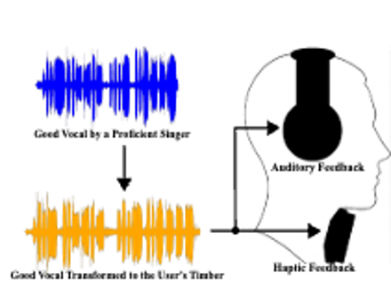
- 概要:
  - 歌唱は、視覚的なフィードバックが直接寄与しない不可視なタスクである。視覚情報は、運動技能や動作において重要な感覚情報であるが、歌唱は不可視なタスクであるため熟達が困難である。従来の歌唱学習は聴覚や身体感覚といった捉えづらい暗黙的情報に依存しており、効果的な学習支援手法の確立が求められる。本研究では、聴覚と触覚を用いたマルチモーダルな歌唱熟達支援システム構築に向け、聴覚的なアプローチの効力検証を行う。具体的には、学習者声質に変換した歌唱見本が模倣精度向上に与える影響を調査する。歌唱における聴覚フィードバックの有効性を検証することにより、触覚モダリティを加えたマルチモーダルな熟達支援システム構築を目指す。マルチモーダルな歌唱熟達支援システムの概要図

## 森下 陸 (25KMH29)
- 研究テーマ: 熟達に伴う神経効率化に基づくリアルタイム課題難易度調整システム
- 参考画像: 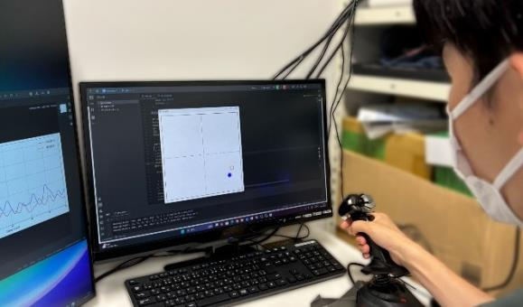
- 概要:
  - 画一的な熟達支援システムでは，個人の熟達スピードの差に適応できない．また，単純なタスク精度による個人適応では，タスクへの「慣れ」といった内在的要素に対し考慮ができていない．そこで本研究では，人の内在的要素の変化に基づいた課題難易度調整システムを提案する．実験としては，2次元の追従タスクを実施し，その時の視線情報を測定する．これらの情報より，被験者の熟達状態を判断し，その熟達度に応じてタスクの難易度を調整する．これにより，人の認知リソースを無駄なく活用する課題難易度調整システムを構築することで，効率的な熟達支援システムの実現を目指す．図 実験の様子

## Marco Romeo (25KMH31)
- 研究テーマ: VR ヘッドセットにおける視線ベースの深度推定
- 参考画像: 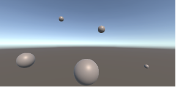
- 概要:
  - 本研究では、VR環境におけるユーザーの視線情報を活用し、注視点の深度推定およびユーザー意図の理解を目指している。従来のアイトラッキング技術は水平方向や垂直方向の精度は高いものの、奥行き方向の推定に課題が残されている。そのため、本研究ではヘッドマウントディスプレイ（HMD）に搭載されたアイトラッカーを用い、注視点の深度を推定するアルゴリズムを開発・評価している。これまでに、Unity環境上で基礎的な視線追跡データの取得と処理を実現し、実験により深度推定の有効性を検証するための基盤を整えた。今後は、得られた知見を応用し、視線に基づくインタラクションや周辺視野の動的制御（例：注視点以外の領域のぼかし処理）に発展させ、より自然かつ効率的なVR体験の実現を目指す。VR環境内での実験の様子

## 大塚 凱 (24KMH04)
- 研究テーマ: 入眠期に特化した連続的睡眠深度の推定
- 参考画像: 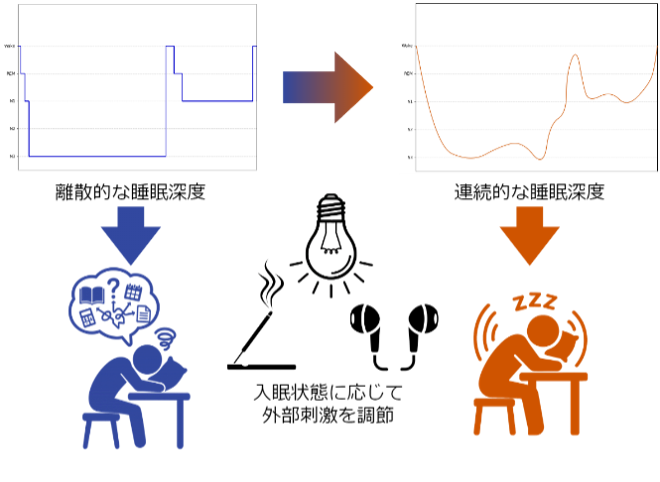
- 概要:
  - 従来の睡眠評価は離散的な段階に分類するため、覚醒から眠りへと滑らかに移行する入眠期の微細な状態変化を捉えることが困難である。これは、個人の脳状態に合わせた精密な睡眠改善技術の実現を妨げる一因となっている。本研究ではこの課題に対し、連続的な睡眠深度を脳波から高精度に推定する新モデルを提案した。生理学的知見に基づくルールモデルが生成した高品質な教師データを深層学習モデル(1D-CNN)が学習する二段階アプローチを採用。その結果、構築したモデルは教師データを高い精度で再現し、生理学的な妥当性も確認された。今後は、本研究で構築した高精度な連続的睡眠深度を教師データとして活用し、より簡便に計測できる心拍情報のみで同等の推定を可能にするモデルの開発を目指す。睡眠深度の可視化とパーソナライズされた覚醒支援

## 北岩 隼人 (24KMH05)
- 研究テーマ: 貝殻繋ぎの指間部位における振動の痛み緩和効果の調査
- 参考画像: 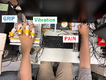
- 概要:
  - 薬に頼らず迅速に痛みを緩和することを目的に、本研究では人が手を握る動作を模したハンド型デバイスを開発した。本デバイスは広い接触面積を持ち、さらに振動機構を用いて疑似的な心拍リズムを提示できる点が特徴である。実験では、振動なし、単なる一定振動、心拍を再現した振動、の3条件を設定し、被験者に痛み刺激を与えて評価を行った。その結果、心拍リズムを提示した条件が最も強い痛み緩和効果を示し、単なる振動よりも高い有効性が確認された。このことから、生体模倣的なリズム提示によるストレス緩和が痛みにも有効である可能性が示唆され、非薬物的な新しい痛みの対処法としての応用が期待される。図 実験時の測定系

## 梁瀬 琉真 (24KMH11)
- 研究テーマ: 指先への力覚提示による道具操作の熟達支援
- 参考画像: 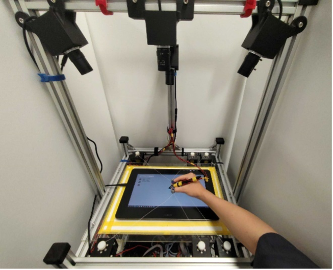
- 概要:
  - 従来の道具操作支援は，道具全体の動きが中心であり，操作を直接担う個々の指の運動特性は未考慮であった．道具操作の一つである筆記動作において，熟達している利き手は指が独立して動く．対して，非利き手では個々の指が独立して運動せず，動作全体がぎこちなくなる．そこで本研究では，利き手における指の独立性に着目し，非利き手の道具操作中において独立性を高める力覚介入を提案する．モータ駆動によるワイヤ牽引機構で各指に個別に力提示を行い，把持力を調整する．この介入により利き手のような分担された指の動きを非利き手で誘発させ，低把持力かつ高精度な道具操作の熟達を目指す．現在は，4台のカメラを使用した筆記動作特性の調査を行い，最適な力提示の制御の作成をしている．図 ワイヤ牽引機構による力覚提示装置

## 劉 樹鵬 (24KMH12)
- 研究テーマ: 周期的な作業における協働作業でのストレス予測
- 参考画像: 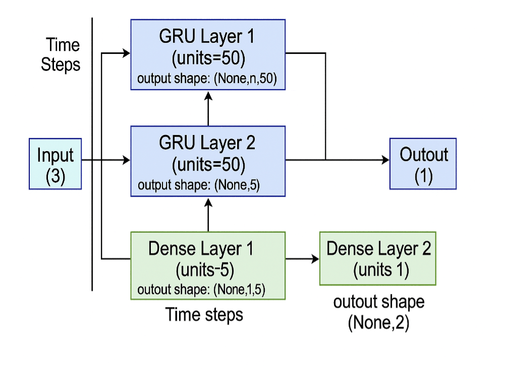
- 概要:
  - 協働ロボットの普及によって人－ロボット間作業におけるストレス等の心理的影響への考慮が必要とされている．増加の原因として特に2者間での作業リズムのずれや，人間側の作業主体間の欠如があげられる．本研究では周期的な動作として指タッピングタスクを行い，聴覚刺激の提示による最適な人の作業リズムの誘導方法として提示間隔の長さを変化させ，有効であるか調査を行う．同時にストレス予測システムを作成し評価を行った．結果として提示音によってストレスの抑制に成功し，予測システムについては最低限有効な予測結果が得られた．今後は予測したストレスデータをもとに最適な誘導を適宜提示するシステムを作成する．予測モデルの機能

## 小林 航大 (22UDE01)
- 研究テーマ: 学習者モデルの提案による教示者アシストシステムの構築
- 参考画像: 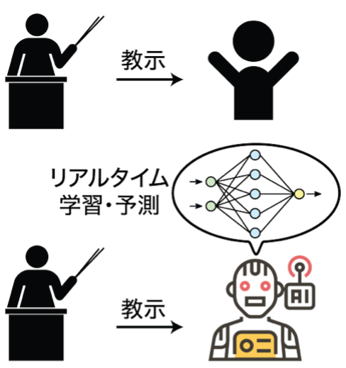
- 概要:
  - 技能の伝承や熟達は機械化が困難な領域において重要な課題であり，人間―人間間の教示の研究が行われている．しかし，同じ学習者による繰り返し実験が困難であり，人間の教示の解析は困難である．これらの要因により，教示効率の向上や教示のアシスト等は行われていない．そこで，本研究では人間の学習プロファイルを再現したモデルを構築し，人間に教示する時と同様にモデルに教示を行う．このモデルは教示者の教示力に応じて学習率を調整するため教示者の教示量に応じた学習が可能である．教示中の変化量や変化傾向について解析を行い，この解析結果を基に，より学習効率が高くなるようアシストすることで，教示者アシストシステムの実現を目指す．Fig. 学習者モデルのイメージ

## 佐々木 元気 (20UDE01)
- 研究テーマ: ヒト同士の物理的協調作業における協調技能の定量評価とパフォーマンス解析
- 参考画像: 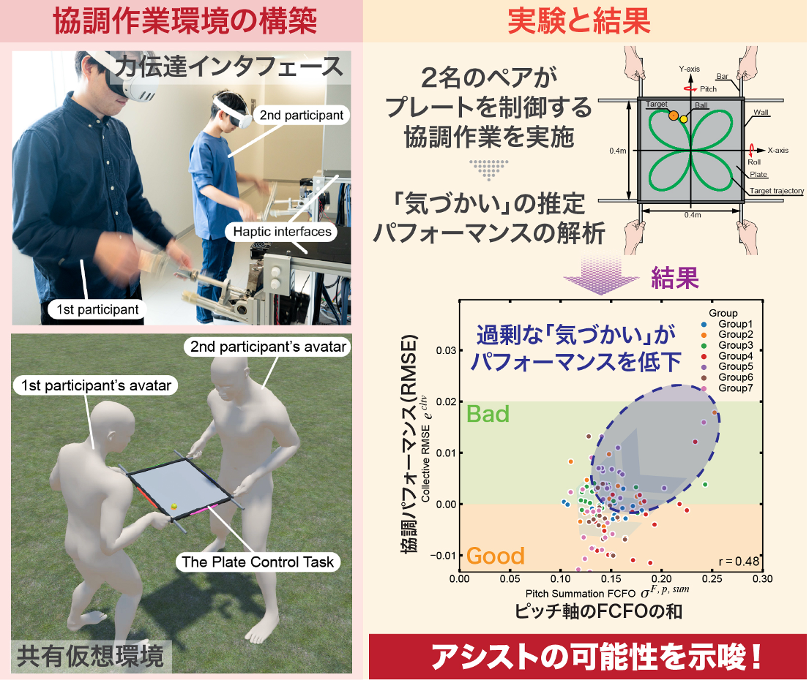
- 概要:
  - ヒト同士の物理的な協調作業をロボットの介在によって支援する技術は、未だ確立されていない重要な研究課題である。本博士論文では、この課題に対し、チームワークを工学的に測定する「気づかい」推定手法を開発し、それに立脚した協調作業中のパフォーマンスを向上させるアシスト手法の確立を目指した。本研究では、協調作業の実験を行うために遠隔仮想環境技術（SVE）と力の伝達が可能なマルチラテラル制御技術を用いて協調作業の開発を行った。そして、協調作業の実験からパフォーマンス向上の要因の探索を行った。その結果、力の「気づかい」が過剰な際にそれを減少させるようなアシストを行うことで、パフォーマンスが向上可能であることがわかった。

## 宮元 大地 (20UDE91)
- 研究テーマ: 浮腫測定デバイスを用いた力学的特性を考慮した浮腫判別手法の提案
- 参考画像: 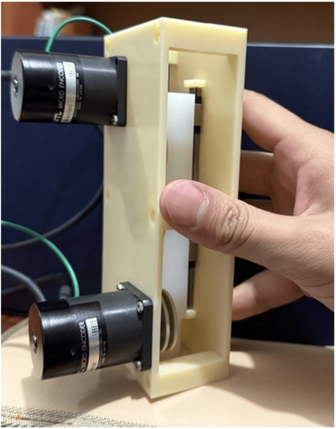
- 概要:
  - 浮腫は様々な病気の症状や要因として発生する．その種類は様々で，押下時に圧痕が残る圧痕性浮腫と圧痕が残らない非圧痕性浮腫により大別される．圧痕性浮腫では医療従事者の従事歴によりばらつきが発生することが明らかとなっている．非圧痕性浮腫では，要因により特性が変化するため，確立された測定手法が存在しない．本研究ではこれまでに，一定の力を加える浮腫測定デバイスを開発し，再現性を有した押下手法を提案した．これにより，圧痕性浮腫の測定手法としての妥当性を示した．本発表では，浮腫の力学的特性に着目し，非圧痕性浮腫の測定に向けた粘弾性モデルの構築と各パラメータの導出を行なう．さらに，ヒトを対象とした実験を視野に入れ，本システムの展開と更なる応用に向けた議論を行う．図 浮腫測定デバイスを用いた測定手法
